# BRBI Credit Investigation Management System

## Architecture and implementation blueprint

Status: Approved architecture; implementation completed through Phase 6.

Revision note: the Business/Income Source architecture now supports selectable official templates, multiple template instances per client, the official `SOURCES OF INCOME DECLARED BY CLIENT` fallback, and future template plug-ins without a combined all-business form.

Prepared from the master requirements and these official references:

- `business report.pdf` - one-page, 8.5 x 13 inch Source of Income Validation form.
- `cibi report.pdf` - one-page, 8.5 x 13 inch Personal, Neighborhood, Residence and Financial Investigation form.
- `residence and business photos.pdf` - eight-page photo report with two large photographs per page and subject-based sections.

## 1. Executive architecture decision

BRBI CIMS should be a Laravel modular monolith backed by MySQL. The client folder is the aggregate root and authorization boundary. Every report, activity, note, media reference, external-storage reference, Telegram message, attachment and audit event is attached to a stable `client_folders.id`; names and display labels are never relationship keys.

The application has two intentionally separate presentation systems:

1. Encoding UI - responsive Blade/Tailwind/Alpine screens optimized for field encoding.
2. Official output UI - report-specific, print-only Blade and DOCX templates optimized for fixed paper layouts.

Long-running report generation and external integration operations run through queues. A failed Google Drive or Telegram operation never rolls back already-saved investigation data.

### Recommended deployment shape

```text
Browser
  -> HTTPS reverse proxy / web server
      -> Laravel web application
          -> MySQL
          -> Queue worker(s)
          -> Private temporary file storage
          -> Google Drive API
          -> Telegram Bot API

Scheduled worker
  -> retry eligible integration jobs
  -> prune expired temporary files and sessions
  -> monitor stale jobs and backups
```

Start as one deployable application. Do not split into microservices: the domain is cohesive, transactions are important, the team is internal, and operational simplicity is valuable. Service interfaces keep report and integration code replaceable later.

## 2. Scope and boundary

### Included

- Private login and user administration.
- Administrator and Credit Investigator authorization.
- Digital client folders, search, rename, assignment, soft deletion, restore and administrator-only permanent deletion.
- Common client information encoded once.
- CI activities, notes and evidence references.
- CI/BI, business, and residence/business photo reports.
- Official PDF, DOCX, browser preview and print outputs with version history.
- Media and attachment metadata, with externally stored originals preferred.
- Google Drive backup/reference workflow.
- Telegram preview, confirmation, sending, history and duplicate prevention.
- Dashboard, global activity/report views, settings and audit trail.
- Automatic progress and two-state client-folder status.

### Explicitly excluded

- Loan origination, approval, approval queues, underwriting decisions and approved/rejected states.
- CRM, sales, inventory, task scheduling and calendar functionality.
- Account Officer accounts or login role. Account Officer is report data only.
- Permanent storage of large original media in the application by default.
- A rigid application-wide wizard.

## 3. Architectural layers

```text
Presentation
  Blade pages, Blade components, Alpine interactions, Tailwind tokens,
  print templates and JSON endpoints used by first-party pages

Application
  Form Requests, Controllers, Actions, Policies, Services,
  DTOs, Events, Listeners, Jobs and Notifications

Domain
  Eloquent models, backed enums, progress/completion rules,
  report semantics and authorization rules

Infrastructure
  MySQL, filesystem, queues, PDF/DOCX adapters,
  Google Drive adapter, Telegram adapter and audit logging
```

Controllers coordinate requests only. Multi-model writes live in transactional Action classes. Reusable business rules live in domain services. External systems are hidden behind interfaces so tests can use fakes.

## 4. Main domain modules

| Module | Responsibilities |
|---|---|
| Identity & Access | Login, logout, session security, users, roles, status and password reset by administrator |
| Dashboard | Relevant counts, recent folders, recent activities and create-folder shortcut |
| Client Folders | Aggregate root, folder number, display name, assignment, search, rename, recycle bin and completion state |
| Client Information | Shared identity, contact, household and typed addresses used to prefill reports |
| CI Activities | Configurable activity definitions, per-folder checklist, detailed records, notes and evidence |
| CI/BI Report | Official personal, neighborhood, residence, financial, credit and income validation data |
| Business / Income Sources | Add an income source, select a registered official template, and open only that template's form; supports multiple dedicated reports and fallback validation records per client |
| Residence & Business Report | Subject/section-based photo report, media ordering, labels and remarks |
| Media & Documents | Metadata, thumbnails when permitted, local temporary references and external references |
| Report Generation | Preview, versioning, PDF, DOCX, print layout and generated artifact history |
| Google Drive | Client folder hierarchy, backup attempts, statuses, retry and links |
| Telegram | Caption preview, explicit confirmation, idempotent queued send, history and retry |
| Settings & Templates | Non-secret organization settings, activity definitions, numbering and report templates |
| Audit | Append-only security and business event log |

## 5. Key workflows

### Create a client folder

1. Validate names, optional client information and assigned CI.
2. In one database transaction, lock the numbering sequence, create the folder, create the one-to-one client-information record, and instantiate active default CI activities.
3. Calculate initial progress.
4. Commit, audit the event and redirect into the folder.
5. Queue Drive-folder creation separately if integration is enabled. A Drive failure does not undo the folder.

Folder number format is configurable, initially `BRBI-CI-{YYYY}-{00000}`. A database-backed sequence scoped by year prevents collisions under concurrent creation.

### Save complex reports

1. Authorize against the folder.
2. Validate the parent form and all repeating rows.
3. In one transaction, update the report header and synchronize child rows by stable IDs.
4. Record an audit summary without copying confidential field values into logs.
5. Recalculate progress and folder status.
6. Redirect back with a saved state; external work is never in the request transaction.

### Generate a report

1. Save and validate current data.
2. Create a `generated_reports` row with `processing` state and next locked version number.
3. Build a deterministic view snapshot from saved database records and their source revision; posted report bodies are never accepted.
4. Render the dedicated official template synchronously in Phase 15, store the artifact on the protected disk, compute its checksum and mark it completed. Later phases may move the same action behind a queue and add Drive backup without changing the record contract.
5. Mark failed with a safe error summary and allow retry.

Existing versions are immutable. “Regenerate” creates a new version rather than silently overwriting history.

### Telegram send

1. Build a preview from saved data and selected media.
2. Require explicit confirmation.
3. Create a message record with an idempotency key derived from client, category, selected media IDs and content hash.
4. Queue sending; reject an accidental duplicate unless the user confirms “send again.”
5. Persist Telegram message IDs/links and each attached media result.

## 6. Database conventions

- MySQL with InnoDB, `utf8mb4`, UTC timestamps in storage and Asia/Manila presentation.
- Unsigned bigint primary keys for internal records. Folder numbers are human identifiers, not keys.
- Foreign keys use `restrict`, `cascade` or `set null` deliberately; never rely on implicit behavior.
- Status columns are strings validated through PHP backed enums, making controlled additions safer than database ENUM migrations.
- Currency uses `decimal(15,2)`; measurements use `decimal(12,2)`; dates and times use native types.
- User-entered long remarks use `text`; provider responses and non-query metadata use `json`.
- All mutable domain tables have timestamps. Soft deletes are used for client folders and user-managed files where recovery is required.
- Confidential values are not duplicated in audit descriptions. Sensitive provider data may be encrypted with Laravel encrypted casts.

## 7. ERD

```mermaid
erDiagram
    USERS ||--o{ CLIENT_FOLDERS : assigned_to
    USERS ||--o{ CLIENT_FOLDERS : created_by
    CLIENT_FOLDERS ||--|| CLIENT_INFORMATION : contains
    CLIENT_FOLDERS ||--o{ CLIENT_ADDRESSES : has
    CLIENT_FOLDERS ||--o| CIBI_REPORTS : has
    CIBI_REPORTS ||--o{ CIBI_BANK_ACCOUNTS : declares
    CIBI_REPORTS ||--o{ CIBI_LOAN_RECORDS : validates
    CIBI_REPORTS ||--o{ CIBI_CREDIT_CHECKS : checks
    CIBI_REPORTS ||--o{ CIBI_INCOME_SOURCES : validates
    INCOME_SOURCES ||--o{ CIBI_INCOME_SOURCES : summarized_by
    CIBI_REPORTS ||--o{ CIBI_LEGAL_FINDINGS : records
    CLIENT_FOLDERS ||--o{ INCOME_SOURCES : declares
    INCOME_SOURCE_TEMPLATES ||--o{ INCOME_SOURCES : selects
    INCOME_SOURCES ||--o| BUSINESS_REPORTS : uses_dedicated_form
    INCOME_SOURCES ||--o| GENERAL_INCOME_SOURCE_REPORTS : uses_fallback_form
    GENERAL_INCOME_SOURCE_REPORTS ||--o{ DECLARED_INCOME_SOURCE_ITEMS : lists
    BUSINESS_REPORTS ||--o{ BUSINESS_PROPERTIES : inspects
    BUSINESS_PROPERTIES ||--o{ BUSINESS_TENANTS : contains
    BUSINESS_REPORTS ||--o{ BUSINESS_BRANCHES : inspects
    BUSINESS_REPORTS ||--o{ BUSINESS_PRODUCTS : sells
    BUSINESS_REPORTS ||--o{ BUSINESS_SUPPLIERS : validates
    BUSINESS_REPORTS ||--o{ BUSINESS_OBSERVATIONS : records
    BUSINESS_REPORTS ||--o{ BUSINESS_COMPETITORS : observes
    CLIENT_FOLDERS ||--o| RESIDENCE_BUSINESS_REPORTS : has
    RESIDENCE_BUSINESS_REPORTS ||--o{ PHOTO_REPORT_SECTIONS : groups
    INCOME_SOURCES ||--o{ PHOTO_REPORT_SECTIONS : documented_by
    PHOTO_REPORT_SECTIONS ||--o{ PHOTO_REPORT_MEDIA : orders
    MEDIA_REFERENCES ||--o{ PHOTO_REPORT_MEDIA : selected_as
    ACTIVITY_DEFINITIONS ||--o{ CI_ACTIVITIES : instantiates
    CLIENT_FOLDERS ||--o{ CI_ACTIVITIES : tracks
    CI_ACTIVITIES ||--o{ ACTIVITY_NOTES : has
    CI_ACTIVITIES ||--o{ ACTIVITY_MEDIA : supports
    MEDIA_REFERENCES ||--o{ ACTIVITY_MEDIA : selected_as
    CLIENT_FOLDERS ||--o{ MEDIA_REFERENCES : references
    INCOME_SOURCES ||--o{ MEDIA_REFERENCES : scopes
    CLIENT_FOLDERS ||--o{ ATTACHMENTS : contains
    CLIENT_FOLDERS ||--o{ GENERATED_REPORTS : generates
    INCOME_SOURCES ||--o{ GENERATED_REPORTS : generates
    CLIENT_FOLDERS ||--o{ GOOGLE_DRIVE_REFERENCES : backs_up
    CLIENT_FOLDERS ||--o{ TELEGRAM_MESSAGES : sends
    TELEGRAM_MESSAGES ||--o{ TELEGRAM_MESSAGE_MEDIA : contains
    MEDIA_REFERENCES ||--o{ TELEGRAM_MESSAGE_MEDIA : sent_as
    CLIENT_FOLDERS ||--o{ AUDIT_LOGS : scopes
    USERS ||--o{ AUDIT_LOGS : performs
    COMPLETION_RULES ||--o{ CLIENT_COMPLETION_RESULTS : evaluates
    CLIENT_FOLDERS ||--o{ CLIENT_COMPLETION_RESULTS : has
```



## 8. Table plan

The lists below specify the meaningful domain columns. Normal Laravel timestamp columns are omitted from repeated descriptions only where obvious.

### Identity and configuration

#### `users`

- `id`, optional unique `employee_id`, `full_name`, unique `username`, `password`.
- `role`: `administrator` or `credit_investigator`.
- `status`: `active` or `disabled`.
- `must_change_password`, nullable `password_changed_at`, and monotonic `auth_session_version` support controlled temporary-password replacement and cross-session invalidation.
- `last_login_at`, `last_login_ip`, `remember_token`, timestamps.
- Indexes: unique username, unique nullable employee ID, `(role,status)`.
- Disabled users cannot start a session and their active sessions should be invalidated.

#### `system_settings`

- `id`, unique `key`, `value` JSON/text, `is_encrypted`, `updated_by`.
- Holds bank name, branch defaults, logo reference, numbering pattern and integration-enabled flags.
- Secrets remain in environment/secret storage; the UI exposes only configured/not-configured state.

#### `activity_definitions`

- `id`, unique `code`, `name`, `description`, `sort_order`, `is_required`, `is_active`.
- Seeded definitions: residence, business, barangay, neighbor, asset, bank/coop checks.
- Deactivation affects new folders by default and does not erase historical activities.

#### `folder_number_sequences`

- `year` primary key, `last_number`, timestamps.
- Row locked during folder creation to guarantee a unique sequential number.

#### `report_templates`

- `id`, `report_type`, `format`, `name`, `version`, `template_reference`, paper width/height and margin settings, `is_active`, `published_by`, `published_at`.
- Unique active-template rule enforced by transaction/application logic per report type and format.
- Official CI/BI, Business/Income Source and Residence & Business Photo templates default to 8.5 x 13 inches. A specific future template may explicitly override that default.

#### `income_source_templates`

- `id`, `template_type`, `version`, official `name`, optional description, business category and compatibility guidance/tags.
- `form_handler`, `data_handler`, `preview_handler`, `pdf_template_key`, `docx_template_key` identify the registered implementation behind stable application interfaces.
- `is_fallback`, `is_active`, `sort_order`, timestamps; unique `(template_type,version)` with one current active version per type enforced transactionally.
- Seed the fallback as `general_income_sources` with the official name `SOURCES OF INCOME DECLARED BY CLIENT`; exactly one active fallback is required.
- Dedicated examples can include the current source-of-income validation/business form, leasing, retail or later BRBI-approved forms. A template is listed only when it has a compatible form, validator and output renderer.
- This is configuration metadata, not a place to store arbitrary executable code or database field definitions.

### Client folder aggregate

#### `client_folders`

- `id`, unique `folder_number`, `display_name`.
- `last_name`, `first_name`, nullable `middle_name`, nullable `suffix`; the display name is regenerated through one formatter.
- `assigned_ci_id` FK users, `created_by` FK users, nullable `updated_by`.
- `status`: only `on_progress` or `completed`.
- cached `progress_percent` decimal(5,2), nullable `completed_at`.
- nullable `deleted_by`, soft-delete `deleted_at`, timestamps.
- Indexes: unique folder number; normalized/searchable name columns; `(assigned_ci_id,status,deleted_at)`; `(status,created_at)`.
- Exact duplicate names are warned about, not automatically rejected, because real clients can share names. Folder number remains unique.

#### `client_information`

- `id`, unique `client_folder_id`.
- nullable `spouse_name`, `age` or preferably `birth_date`, `civil_status`, `contact_number`, `email`.
- `length_of_stay_months`, `dependents_count`, `home_ownership`, `home_condition`, `material_cost_level`, `living_condition`, `reputation`, `lifestyle`, `vehicles_owned`.
- `other_residences`, `barangay_findings`, `court_background_summary`, `other_remarks`.
- `completion_state`, `completed_at`, `last_edited_by`, timestamps.
- Names in the folder remain the canonical applicant identity; this table holds reusable profile details.

#### `client_addresses`

- `id`, `client_folder_id`, `address_type` (`present`, `previous`, `parents`, `residence`, `business`, `other`).
- address lines, barangay, city/municipality, province, postal code, country, optional map link.
- `is_primary`, `length_of_stay_months`, `sort_order`, timestamps.
- Index: `(client_folder_id,address_type,is_primary)`.

### CI/BI report

#### `cibi_reports`

- `id`, unique `client_folder_id`, `ci_in_charge_id`, `start_date`, `submitted_date`.
- `party_type` borrower/co-maker, `branch_name`, `account_officer_name`, `amount_applied`.
- `ci_risk_level`, `purpose_codes` JSON plus `purpose_other`, `purpose_remarks`.
- `negative_credit_findings`, `other_remarks`, `prepared_by_name`, `noted_by_name`.
- `state` draft/complete, `completed_at`, `last_edited_by`, `revision`.
- Common personal fields are read from client information at render time. A generated version keeps an immutable snapshot so later client edits do not alter old files.

#### `cibi_bank_accounts`

- `id`, `cibi_report_id`, institution, branch, year opened, ADB level, capital/share amount, relevant remarks, sort order.

#### `cibi_loan_records`

- `id`, `cibi_report_id`, institution, original amount, remaining balance, amortization, granted date, maturity date, cycle number, security type, payment performance, remarks, sort order.

#### `cibi_credit_checks`

- `id`, `cibi_report_id`, institution, branch, declared flag, check status, checked date, key information, remarks, sort order.
- Summary totals shown in the official form are calculated from rows, not independently encoded.

#### `cibi_income_sources`

- `id`, `cibi_report_id`, optional `income_source_id`, source name/type, stability result, validation status, key information, monthly amount, sort order.
- Linking to `income_sources` allows the CI/BI validation summary to reference either a dedicated business template or the official general fallback record.

#### `cibi_legal_findings`

- `id`, `cibi_report_id`, source level (`barangay`, `court`, `other`), result, details, checked_at, sort order.

### Business / income-source template instances

#### `income_sources`

- `id`, `client_folder_id`, `income_source_template_id`, copied `template_type` and `template_version` for historical stability.
- user-facing `source_name`, optional `business_name`, `contribution_rank`, optional `estimated_monthly_contribution` and `is_primary`.
- common report data: applicant-name snapshot or canonical applicant reference, `branch_name`, `amount_applied`, and `account_officer_name` as report data only.
- `state` draft/complete, `completed_at`, `last_edited_by`, `revision`, `sort_order`, timestamps and optional soft delete.
- Indexes `(client_folder_id,state)`, `(client_folder_id,contribution_rank)`, `(client_folder_id,template_type)`.
- This is the stable aggregate anchor selected by `+ Add Income Source`. It owns media and generated artifacts regardless of which template-specific detail table is used.
- `template_type` is never changed in place after meaningful data exists. Changing templates creates a replacement record or runs an explicit, audited compatibility migration.

#### `general_income_source_reports`

- `id`, unique `income_source_id`, general remarks/details and template-specific completion metadata.
- This is the official fallback form, not an error or “other/unrecognized” state.
- Applicant, branch, amount applied and Account Officer fields are supplied by the parent `income_sources` record.

#### `declared_income_source_items`

- `id`, `general_income_source_report_id`, source name/type, description/details, optional amount/contribution, `contribution_rank`, remarks and `sort_order`.
- Unique rank per fallback report where a rank is supplied; rank `1` means highest contribution.
- A fallback record may list several declared income sources. A client may also have several separate fallback records when BRBI needs distinct validation groups or report versions.

#### `business_reports`

- `id`, unique `income_source_id`, `business_name`, `report_category` (`leasing`, `retail`, `water_refilling`, `other_compatible`).
- main and previous address references or snapshots, reason for transfer, registered owner, relationship to borrower.
- year established, length of stay, monthly rent, ownership type, business type, scale, informant.
- inspection totals and template-specific report remarks; canonical draft/completion state, editor and revision remain on `income_sources`.
- This table contains only the fields shared by the currently approved compatible dedicated business template. Its normalized child tables remain below.
- Future materially different official templates receive their own detail and child tables linked one-to-one to `income_sources`; they do not add unrelated fields to this table or a universal form.

#### `business_properties`

- `id`, `business_report_id`, property type, declared/inspected flags, reason not inspected, units available, units with tenants, location, area square meters, contract flag, remarks, sort order.

#### `business_tenants`

- `id`, `business_property_id`, tenant name, monthly rent, years renting, contract flag, contact details, remarks, sort order.

#### `business_branches`

- `id`, `business_report_id`, location, declared/inspected flags, reason not inspected, frontage meters, total area, air-conditioned flag, operating days/hours, shifts, employees per shift, average sales per shift, inventory level, monthly rent, years in area, nearby brands, sort order.

#### `business_products`

- `id`, `business_report_id`, product name, unit/size, selling price, stock level, is_top_seller, sort order.

#### `business_suppliers`

- `id`, `business_report_id`, supplier name, office location, contact information, confirmed flag, years transacting, payment performance, remarks, sort order.

#### `business_observations`

- `id`, `business_report_id`, `observation_code`, question snapshot, answer, remarks, sort order.
- Codes cover competitors, location quality, customer activity, stock, POS/cash register, refrigeration and declared income bank.

#### `business_competitors`

- `id`, `business_report_id`, name, location, notes, sort order.

### Residence/business photo report and media

#### `residence_business_reports`

- `id`, unique `client_folder_id`, report date, default location, default subject, CI user, residence remarks, business remarks, state, completed at, revision.

#### `photo_report_sections`

- `id`, `residence_business_report_id`, optional `income_source_id`, category (`residence`, `business`, `other`).
- subject party (`applicant`, `co_maker`, `other`), subject name, heading/subject, location, business name, map link, remarks, sort order.
- This table is required by the eight-page reference: one report can contain the applicant residence, several distinct business checks and a co-maker residence. Business sections can point to the exact income-source instance they document.

#### `media_references`

- `id`, `client_folder_id`, optional `income_source_id`, `media_type` photo/video, category residence/business/other.
- `file_name`, label, remarks, MIME type, byte size, checksum, captured at, uploaded by.
- optional temporary/private local path with expiry; optional thumbnail path.
- Drive file ID/link, Telegram file/message references, map link, backup and send statuses.
- Indexes `(client_folder_id,category,media_type)`, `(income_source_id,category,media_type)`, Drive file ID, checksum.
- The folder FK remains mandatory for authorization and search; the income-source FK adds precise ownership for business evidence without losing folder-level grouping.
- Original media should be removed from temporary application storage after verified Drive transfer according to an approved retention policy.

#### `photo_report_media`

- `id`, `photo_report_section_id`, `media_reference_id`, output label/caption, `sort_order`, optional crop/orientation metadata.
- Unique `(photo_report_section_id,media_reference_id)`.
- The print renderer places two large photographs per page by default and automatically paginates continuation pages.

### Activities

#### `ci_activities`

- `id`, `client_folder_id`, `activity_definition_id`, copied `name` for historical stability.
- status `not_started`, `in_progress`, `completed`; visit date, time in/out, visited by, person met/contact, remarks, supporting reference, completed at, updated by.
- Unique `(client_folder_id,activity_definition_id)` for default activities.
- Index `(client_folder_id,status)` and `(status,updated_at)` for global activity view.

#### `activity_notes`

- `id`, `ci_activity_id`, `user_id`, note, follow-up-needed flag, timestamps.
- Notes are appendable; edits should be audited.

#### `activity_media`

- `ci_activity_id`, `media_reference_id`, label, timestamps; composite unique key.

### Generated artifacts and integrations

#### `generated_reports`

- `id`, `client_folder_id`, optional `income_source_id`, `source_type`, `source_id`, report type, format PDF/DOCX.
- monotonically increasing `version`, template version, source revision/snapshot JSON, status processing/completed/failed.
- private file reference or Drive file ID, MIME type, byte size, checksum, generated by/at, failure code/message.
- Version uniqueness is scoped to the logical source: folder-wide reports use `(client_folder_id, report_type, format, version)` while income-source reports use `(income_source_id, report_type, format, version)`; index `(status,created_at)`.
- The explicit income-source FK makes dedicated and fallback outputs directly traceable even though `source_type/source_id` still supports other report modules.

#### `attachments`

- `id`, `client_folder_id`, category, original filename, MIME type, size, checksum, uploaded by/at.
- private local reference and/or external provider/file ID/link, status, soft deletes.

#### `google_drive_references`

- `id`, `client_folder_id`, `resource_type`, `resource_id`, Drive file/folder ID, parent Drive folder ID, web view link.
- backup status queued/processing/completed/failed, attempt count, last attempted/backed up at, error code/message, metadata JSON.
- Unique provider ID; unique `(resource_type,resource_id)` when one current backup is expected.

#### `telegram_messages`

- `id`, `client_folder_id`, category, message type, caption, caption hash, idempotency key.
- chat ID stored encrypted or referenced from configuration, Telegram message ID/link, sent by/at.
- photo/video counts, status queued/processing/sent/failed, retry count, error code/message.
- Unique idempotency key for non-forced sends.

#### `telegram_message_media`

- `id`, `telegram_message_id`, `media_reference_id`, Telegram file/message ID, status, sort order, error summary.

### Completion and audit

#### `completion_rules`

- `id`, unique code, label, source type, source condition JSON, required flag, active flag, sort order, and nullable future `weight`.
- Initial rules cover client information, CI/BI, applicable income-source template instances, residence/business report, each required activity and configured generated output.
- Conditions are interpreted only by `ClientProgressService`, never scattered through controllers. The initial implementation ignores weights and uses applicable required-item completion.

#### `client_completion_results`

- `id`, `client_folder_id`, `completion_rule_id`, satisfied flag, score, explanation key, evaluated at.
- Unique `(client_folder_id,completion_rule_id)`.
- Provides a fast and explainable Completed/Incomplete summary.

#### `audit_logs`

- `id`, nullable `user_id`, nullable `client_folder_id`, action, module, description, metadata JSON, IP address, user agent, created at.
- Append-only; no update/delete UI. Indexes `(client_folder_id,created_at)`, `(user_id,created_at)`, `(module,action,created_at)`.
- Store changed field names and record IDs where useful, not passwords, tokens or unnecessary confidential before/after values.

## 9. Relationship and deletion policy

| Parent | Child | Cardinality | Delete behavior |
|---|---|---:|---|
| User | assigned client folders | 1:N | Restrict/require reassignment before user removal; users are disabled, not normally deleted |
| Client folder | client information | 1:1 | Cascade only during administrator-confirmed permanent purge |
| Client folder | CI/BI report | 1:0..1 | Cascade on permanent purge |
| Client folder | income sources | 1:N | Cascade only on administrator-confirmed permanent purge |
| Income-source template | income sources | 1:N | Restrict deletion once used; deactivate/version templates instead |
| Income source | dedicated business detail | 1:0..1 | Cascade with the income-source instance |
| Income source | general fallback detail | 1:0..1 | Cascade with the income-source instance |
| General fallback detail | declared income-source items | 1:N | Cascade with its fallback record |
| Income source | media/generated reports | 1:N | Cascade metadata only during explicit income-source or folder purge; external deletion follows retention policy |
| Client folder | residence/business report | 1:0..1 | Cascade on permanent purge |
| Client folder | activities/media/artifacts/messages/attachments | 1:N | Cascade database metadata on permanent purge after external-cleanup decision |
| Report parent | normalized child rows | 1:N | Cascade when its report is permanently purged |
| Media | report/activity/Telegram pivots | 1:N | Restrict while referenced, or remove references in an explicit transaction |
| User | audit logs | 1:N | Set null if legal retention permits user purge; preserve actor name/ID snapshot in metadata |

Moving a client folder to Recycle Bin only sets `deleted_at/deleted_by`; all children remain intact and normal queries exclude it. Restore clears both values. Permanent deletion is administrator-only, requires a typed confirmation, performs a dependency preview, and records a final audit record outside or before the cascade. External Drive deletion is a separate explicit policy decision; it must not happen implicitly unless BRBI approves it.

Each `income_sources` row must have exactly one compatible template-specific detail record after initialization: a dedicated detail record such as `business_reports`, or `general_income_source_reports` for the fallback. The application enforces this invariant transactionally through the template registry. Database foreign keys enforce each one-to-one link; consistency tests verify that an instance never owns two incompatible detail types.

## 10. Authorization plan

Use Laravel-native session authentication with no registration route. A lightweight first-party Blade auth starter is appropriate; authorization is implemented through middleware and Policies rather than UI hiding alone.

### Access rule

- Administrator: all active and deleted client folders.
- Credit Investigator: active folders assigned to that user. A folder created by a CI is assigned to that CI by default.
- Each folder has exactly one primary/assigned Credit Investigator in the initial version. Do not add a `client_folder_user` or other many-to-many ownership/access table.
- Real-world assistance is recorded at activity level through `visited_by`, `updated_by` and note authorship by another authorized user where permitted; this does not change folder ownership.

### Capability matrix

| Capability | Administrator | Credit Investigator |
|---|:---:|:---:|
| Manage/disable/reset users | Yes | No |
| View every folder | Yes | No, assigned only |
| Create/rename folder | Yes | Yes |
| Move folder to Recycle Bin | Yes | Yes, assigned only |
| Restore folder | Yes | Configurable; default assigned folders only |
| Permanently delete | Yes | Never |
| Encode reports, activities and notes | Yes | Yes, assigned only |
| Generate/print/export reports | Yes | Yes, assigned only |
| Configure integrations/settings/templates | Yes | No |
| Send confirmed Telegram messages | Yes | Yes, assigned only |
| View audit trail | Yes | No |

Policies: `UserPolicy`, `ClientFolderPolicy`, `ClientInformationPolicy`, `CibiReportPolicy`, `BusinessReportPolicy`, `ResidenceBusinessReportPolicy`, `CiActivityPolicy`, `MediaReferencePolicy`, `GeneratedReportPolicy`, `TelegramMessagePolicy`, `SettingPolicy` and `AuditLogPolicy`.

## 11. Route and controller plan

All application routes use `auth`, `active.user`, CSRF protection and appropriate throttling. Folder-nested routes use scoped route-model binding so a child record cannot be loaded through a different folder URL.

### Authentication

| Method | URI | Name | Purpose |
|---|---|---|---|
| GET | `/login` | `login` | BRBI login page |
| POST | `/login` | `login.store` | Authenticated session creation, throttled |
| POST | `/logout` | `logout` | Session termination |

### Dashboard and client folders

| Method | URI | Name |
|---|---|---|
| GET | `/dashboard` | `dashboard` |
| GET | `/client-folders` | `client-folders.index` |
| GET | `/client-folders/search` | `client-folders.search` |
| GET | `/client-folders/create` | `client-folders.create` |
| POST | `/client-folders` | `client-folders.store` |
| GET | `/client-folders/{clientFolder}` | `client-folders.show` |
| GET | `/client-folders/{clientFolder}/edit-name` | `client-folders.edit-name` |
| PATCH | `/client-folders/{clientFolder}/name` | `client-folders.update-name` |
| DELETE | `/client-folders/{clientFolder}` | `client-folders.destroy` (soft delete only) |
| GET | `/recycle-bin` | `recycle-bin.index` |
| POST | `/recycle-bin/{clientFolder}/restore` | `recycle-bin.restore` |
| DELETE | `/recycle-bin/{clientFolder}/force` | `recycle-bin.force-destroy` (admin only) |

The search endpoint returns a Blade partial/HTML fragment for debounced Alpine updates; it is not a separate public API.

### Folder modules

| Module | Routes under `/client-folders/{clientFolder}` |
|---|---|
| Client Information | `GET /client-information/edit`, `PUT /client-information` |
| CI Activities | `GET /activities`, `GET /activities/{activity}`, `PUT /activities/{activity}`, `POST /activities/{activity}/notes` |
| CI/BI | `GET /cibi/edit`, `PUT /cibi`, `GET /cibi/preview` |
| Business / Income Sources | `GET /income-sources`, `GET /income-sources/create` (template selector), `POST /income-sources`, `GET /income-sources/{incomeSource}/edit`, `PUT`, `DELETE`, `GET /preview` |
| Residence/Business | `GET /residence-business-report/edit`, `PUT`, `GET /preview`; section and media-order endpoints nested beneath it |
| Media | `GET /media`, `POST /media-references`, `PATCH/DELETE /media-references/{media}`; create/update accepts an authorized optional `income_source_id` |
| Attachments | `GET /attachments`, `POST`, `DELETE /attachments/{attachment}` |
| Generated Reports | `GET /generated-reports`, `POST /generated-reports`, `GET /{report}`, `GET /{report}/download`, `POST /{report}/retry` |
| Drive | `GET /google-drive`, `POST /google-drive/backups`, `POST /google-drive/references/{reference}/retry` |
| Telegram | `GET /telegram`, `POST /telegram/preview`, `POST /telegram/messages`, `POST /telegram/messages/{message}/retry` |

Report preview uses a browser page with paginated print HTML or an embedded completed PDF. Print actions target the official template, never the encoding page.

The income-source creation flow is deliberately two-stage:

1. `GET /income-sources/create` shows active compatible official templates plus the official fallback.
2. `POST /income-sources` transactionally creates the `income_sources` anchor and the correct template-specific detail record, then redirects to that template handler's edit route.

The selected handler owns validation, fields, preview and output assembly. The fallback is always selectable and is loaded normally when no dedicated compatible template exists. There is no route or form that merges fields from every registered business type.

### Global and administrator routes

- `GET /activities` - accessible global activity list.
- `GET /reports` - accessible generated-report list.
- `GET /media` - accessible global media metadata view.
- `GET /telegram-history` and `GET /google-drive` - accessible integration histories.
- Admin resource routes under `/admin/users` for create/edit/disable/reset-password.
- Admin routes under `/admin/settings`, `/admin/report-templates`, `/admin/activity-definitions` and `/admin/audit-logs`.
- Password reset by an administrator should issue a temporary password or force-change flag through a controlled workflow; never reveal current passwords.

## 12. Application class plan

### Actions

- `CreateClientFolder`, `RenameClientFolder`, `MoveClientFolderToRecycleBin`, `RestoreClientFolder`, `PermanentlyDeleteClientFolder`.
- `SaveClientInformation`, `SaveCibiReport`, `AddIncomeSource`, `SaveIncomeSource`, `RemoveIncomeSource`, `SaveResidenceBusinessReport`, `UpdateCiActivity`.
- `RequestReportGeneration`, `RequestDriveBackup`, `RequestTelegramSend`.

### Services and interfaces

- `ClientNameFormatter` and `FolderNumberGenerator`.
- `ClientProgressService` and rule evaluators.
- `IncomeSourceTemplateRegistry`, `IncomeSourceTemplateHandler` contract, `DedicatedBusinessTemplateHandler` and `GeneralIncomeSourcesTemplateHandler`.
- `ReportDataAssembler`, `ReportVersionService`, `PdfGenerator`, `DocxGenerator`.
- `DriveClient`/`GoogleDriveService`, `TelegramClient`/`TelegramService`.
- `TelegramCaptionBuilder`, `MediaReferenceService`, `AuditService`.
- Package-specific PDF and Word libraries stay behind generator interfaces. The exact libraries are selected and verified in Phase 1 against both official one-page forms and the eight-page image layout using the confirmed 8.5 x 13 inch default.

### Jobs

- `GeneratePdfReportJob`, `GenerateDocxReportJob`.
- `CreateDriveClientFolderJob`, `UploadToGoogleDriveJob`, `RetryDriveBackupJob`.
- `SendTelegramMessageJob`, `SendTelegramMediaGroupJob`.
- `PruneExpiredTemporaryMediaJob` and optionally `RecalculateClientProgressJob` for bulk configuration changes.

Every external job is idempotent, records state transitions, uses bounded exponential backoff, and distinguishes retryable network/provider errors from permanent validation/configuration errors.

### Events/listeners

- Folder/report/activity saved events trigger progress recalculation and auditing.
- Client folder created may queue Drive folder creation after transaction commit.
- Generated report completed may optionally queue Drive backup only when configured.
- Events carry record IDs, not large payloads or secrets.

## 13. Report-template strategy based on the references

### CI/BI official output

The source is a compact one-page 8.5 x 13 inch form with the BRBI header and five numbered sections:

1. Validated Personal Information.
2. Validated Purpose for Loan Application.
3. Bank/Financial Institution.
4. Summary on Credit/Loan Information.
5. Income Sources Validation.

It also contains CI header data, borrower/co-maker selection, risk assessment, calculated institution/loan totals, negative findings, other remarks, Prepared By and Noted By. The web form should split these into tabs or collapsible sections, but the print template must restore the compact bordered layout. Repeating bank, loan and income rows come from child tables and should intelligently continue to an appendix or additional page if they exceed the official one-page capacity; data must never be silently dropped or shrunk below legibility.

### Business / income-source official outputs

The attached source is one compatible dedicated template: a compact one-page 8.5 x 13 inch form with:

- CI/header data.
- Leasing Operations: Non-Agricultural Real Estate.
- Property inspection summary and tenant/contract details.
- Retail/Grocery/Supermarket/Sari-Sari/Water Refilling profile.
- Branch inspection summary.
- Top sellable products.
- Seven business-inspection observations.
- Supplier validation.
- Other remarks.

The normalized dedicated-template design supports an arbitrary number of rows. The official first page preserves its established sections; overflow is continued on clearly labeled supplemental pages rather than truncated.

This attached form must not become a universal Business Report. The Business / Income Sources module first creates an `income_sources` anchor and requires a template selection. Only the chosen handler's form is opened. A client can combine any number of compatible dedicated template instances with one or more general fallback instances.

When no compatible dedicated template exists, the official `SOURCES OF INCOME DECLARED BY CLIENT` form is the normal fallback. Its output contains Applicant Name, Branch, Amount Applied, Account Officer as report data, ranked declared-income rows, general remarks/details, and the standard Preview, PDF, DOCX and Print actions. Rank `1` is rendered as the highest contribution.

To add a future official template, a developer adds its registered handler, dedicated validator/form, print and DOCX templates, and only the detail/child tables that template needs; then an administrator activates its `income_source_templates` metadata. Existing routes, `income_sources`, media links, generated-report links, progress logic and folder navigation remain unchanged.

### Residence/business photo output

The reference uses the official portrait 8.5 x 13 inch size, with a compact header containing applicant or co-maker name, location, subject, date and CI, followed by two large photographs per page. Some continuation pages contain only labels and photographs. The renderer should:

- group pages by `photo_report_sections`;
- repeat the section header on the first page and optionally on every page based on template setting;
- place two aspect-ratio-preserving photographs per page with labels;
- rotate using EXIF metadata and avoid stretching/cropping by default;
- create continuation pages automatically;
- render remarks at the end of each section;
- support applicant, co-maker and multiple distinct business subjects.

### Preview/version integrity

- The browser preview and PDF use the same print Blade template and print stylesheet.
- DOCX uses a semantically equivalent dedicated template because HTML-to-DOCX fidelity is unreliable for dense forms.
- Generated artifacts store template version, source revision/snapshot and checksum.
- Previewing current draft is allowed; a generated/downloadable version is immutable.
- Official print/PDF CSS defaults to `@page { size: 8.5in 13in; }`, with template-controlled margins, deliberate page breaks, preserved table borders, readable font sizes and official BRBI proportions. It does not default to A4 or US Letter.

## 14. Progress and completion model

`ClientProgressService` evaluates active rows in `completion_rules` and writes explainable per-rule results. Initial completion is checklist based; no component weighting is finalized or hard-coded.

For the Phase 10 Client Information evaluator, the minimum seeded rule condition requires canonical first and last names, birth date, civil status, contact number, and a present address containing address line 1, city/municipality, and province. These are checklist requirements only; no weights are introduced. Recalculation initializes active required rule results as pending where a later module has not yet evaluated them, preventing a single completed module from prematurely marking the folder Completed.

For each folder, the service identifies applicable required rules, counts those satisfied, and calculates the visual percentage as `completed applicable required items / total applicable required items * 100`. Rules that are genuinely not applicable are excluded from the denominator. The missing-items summary comes from the same evaluated results.

For example, the Business / Income Sources rule becomes applicable when at least one source is declared and can require every non-deleted source instance to satisfy its selected template's completion contract. The fallback is a valid completed template, never a missing dedicated form.

The folder becomes `completed` automatically only when every applicable required item is satisfied. Otherwise it remains `on_progress`. Users cannot directly set the folder status. Each module may expose its own draft/complete state without creating additional visible folder statuses. The rule schema and service boundary retain an optional future weighting capability, but the initial calculation does not use it.

## 15. UI information architecture

### Shell

- Dark BRBI green sidebar; light workspace; amber progress; green completed; red only for destructive/error states.
- Sidebar: Dashboard, Client Folders, CI Activities, Reports, Photos & Videos, Telegram History, Google Drive, Recycle Bin, Settings; Users and Audit Trail are administrator-only.
- Desktop selected-folder preview; tablet drawer; mobile stacked view.
- Large yellow folder cards are the primary folder interface. Tables are reserved for dense secondary histories and administrative lists.

### Reusable Blade components

- Layout: app shell, sidebar, topbar, mobile navigation, user identity footer.
- Data display: summary card, folder card, folder icon, status badge, progress bar, client header, breadcrumb, module card, empty state.
- Forms: section, input, select, checkbox/radio group, textarea, repeater row, validation message, sticky form toolbar.
- Interaction: modal, confirmation dialog, context menu, toast, tabs/accordion, loading and retry state.
- Workflow: activity checklist item, note timeline, media card, integration status, missing-items summary, report preview toolbar, recycle-bin item.

Design tokens should define BRBI greens, folder yellow, amber, error red, neutrals, radii, shadows, spacing and typography in one Tailwind theme layer. Accessibility requires keyboard operation, visible focus, semantic labels, sufficient contrast and non-color status cues.

## 16. Proposed Laravel folder structure

```text
app/
  Actions/
    ClientFolders/
    ClientInformation/
    Activities/
    IncomeSources/
    Reports/
    Integrations/
  Enums/
  Events/
  Exceptions/
  Http/
    Controllers/
      Auth/
      ClientFolders/
      ClientInformation/
      Activities/
      IncomeSources/
      Reports/
      Media/
      Integrations/
      Admin/
    Middleware/
    Requests/
      Auth/
      ClientFolders/
      IncomeSources/
      Reports/
      Activities/
      Integrations/
  Jobs/
    Reports/
    GoogleDrive/
    Telegram/
    Maintenance/
  Listeners/
  Models/
  Policies/
  Providers/
  Services/
    ClientFolders/
    Progress/
    IncomeSources/
      Contracts/
      Templates/
        DedicatedBusiness/
        GeneralIncomeSources/
    Reports/
      Contracts/
      Pdf/
      Docx/
    Integrations/
      GoogleDrive/
      Telegram/
    Audit/
  Support/
    DataTransferObjects/
    ValueObjects/
bootstrap/
config/
  cims.php
  services.php
database/
  factories/
  migrations/
  seeders/
public/
resources/
  css/
    app.css
    print/
  js/
    app.js
    components/
  views/
    auth/
    components/
      layout/
      folders/
      forms/
      reports/
      media/
    dashboard/
    client-folders/
    client-information/
    activities/
    income-sources/
      select-template/
      templates/
        dedicated-business/
        general-income-sources/
    reports/
      cibi/
      residence-business/
      generated/
      print/
    media/
    integrations/
      google-drive/
      telegram/
    recycle-bin/
    admin/
routes/
  web.php
  auth.php
  admin.php
  client-folders.php
storage/app/
  private/
    temporary-media/
    generated-reports/
tests/
  Feature/
    Auth/
    Authorization/
    ClientFolders/
    Reports/
    Activities/
    Integrations/
    Admin/
  Unit/
    Progress/
    Reports/
    Integrations/
```

Route files remain a small organizational aid and are loaded by the application bootstrap. This is still one Laravel application, not separate modules/packages.

## 17. Security and operational controls

- HTTPS only in production; secure, HTTP-only, same-site cookies; session regeneration on login and invalidation on logout/password reset/disable.
- Login throttling by username/IP and generic failure messages.
- Argon2id or Laravel's supported secure default password hashing; no recoverable passwords.
- CSRF on state-changing web requests, strict server-side Form Requests and scoped model binding.
- Policies on every folder and nested resource; route access is never inferred from hidden buttons.
- Secrets in environment/secret manager; encrypted database casts only where a database-held credential is unavoidable.
- Private storage disks; signed, short-lived download routes after authorization; block executable uploads and validate MIME, extension and size.
- Optional malware scanning for attachments before availability.
- Content Security Policy and output escaping; sanitize any intentionally rendered rich text.
- Database backup, restoration drill, queue monitoring, failed-job review, structured application logs and audit retention.
- Mask sensitive information in logs and exception monitoring.
- Service accounts/bot accounts use least privilege and dedicated BRBI-owned credentials.
- A formal retention policy is required for temporary media, generated reports, audit logs, deleted folders and external Drive objects before production.

## 18. Testing strategy

### Unit tests

- Name formatting and folder-number concurrency.
- Applicable required-item counting, simple visual percentage, conditional rules, missing-item explanations and automatic status transitions.
- Telegram caption formatting and idempotency keys.
- Report data assembly, totals and pagination decisions.
- Income-source template resolution, fallback selection, handler compatibility and contribution ranking.
- Integration error classification and retry rules.

### Feature tests

- Login/logout, throttling, disabled users and no public registration.
- Every role/policy boundary, including forged nested folder IDs.
- Folder create transaction/default activities, duplicate-name warning, rename, soft delete, restore and admin-only purge.
- Each report save, repeating child-row synchronization and validation rollback.
- Multiple mixed income-source templates per client, fallback records with multiple ranked rows, and rejection of incompatible template handlers.
- Activity updates/notes and automatic progress recalculation.
- Report version creation, authorized downloads and immutable versions.
- Drive/Telegram success, failure, retry and duplicate-send protection using fakes.
- Audit coverage for required events.

### Rendering and end-to-end tests

- Golden/sample rendering comparisons for all three official report types.
- Text-presence, page-count, border/overflow and image-orientation checks on generated PDF/DOCX.
- Desktop, tablet and mobile workflows with no horizontal overflow.
- Keyboard navigation and basic accessibility checks.
- Full normal CI journey from login to completed folder.

## 19. Phased implementation roadmap

Each phase begins with an implementation note naming migrations/models/controllers/views/services, dependencies and test cases, and ends only after migrations, routes, policies, UI and tests pass. Changed files are summarized before the next phase.

### Phase 1 - Project setup and architecture

- Create the Laravel project, environment example, MySQL/queue/mail/log configurations and CI checks.
- Establish coding standards, modular folders, service interfaces and architecture decision records.
- Establish UTC persistence/Asia-Manila presentation configuration and the 8.5 x 13 inch official report default.
- Record the report-generation adapter decision boundary; full report templates remain in their approved feature phases.
- Exit: application boots, test runner and asset build pass, no secrets committed.

### Phase 2 - Database schema and migrations

- Implement identity, configuration, folder, client, report, child, activity, media, integration, completion and audit migrations in dependency order.
- Add models, relationships, casts, enums, factories and safe demo seeders.
- Exit: migrate fresh/rollback/seed succeeds and relationship tests pass.

### Phase 3 - Authentication

- Private username login, remember me, logout, five-attempt username/IP throttling, secure session regeneration, disabled-user enforcement and required password change.
- Provision the first Administrator only through the interactive `cims:create-admin` command; no Administrator credentials are seeded.
- Provide an audited Administrator password-reset action that marks the temporary password for change, rotates remember credentials and invalidates current sessions. Its user-management UI remains in Phase 4.
- Exit: auth feature/security tests pass; no registration route exists.

### Phase 4 - Roles and authorization

- Add explicit policies for users, folders and folder-backed resources; Administrator-only gates for settings/audit; role middleware; assigned-CI query scoping; and scoped nested route binding.
- Add Administrator user management for listing, creating, editing, role assignment, activation/disable and audited password reset. Disabling or changing a role invalidates sessions; users are preserved rather than deleted.
- Exit: the permission matrix is covered by policy, cross-CI isolation, forged nested ID and direct URL tests.

### Phase 5 - Global BRBI UI layout

- Implement centralized BRBI design tokens, responsive sidebar/topbar shell, authorization-aware navigation, reusable Blade component foundations, consistent authentication/user-management presentation, empty/loading/error states and the shared 8.5 x 13 inch print CSS foundation.
- Use a persistent desktop sidebar, drawer-based mobile/tablet navigation, single-column mobile forms, touch-sized controls, semantic status text, visible focus, native dialog/disclosure semantics and keyboard-operable tabs.
- Exit: component rendering, responsive markup, navigation visibility, authentication regressions, Administrator UI regressions and production asset build pass.

### Phase 6 - Dashboard

- Add policy-scoped active-folder totals, On Progress/Completed counts, completed generated-report count, recent yellow folder cards, recent CI activities and a protected future create-folder shortcut.
- Administrator queries span all active folders. Credit Investigator queries consistently apply the indexed `assigned_ci_id`; deleted folders remain in Recycle Bin and are excluded from operational dashboard totals.
- Exit: fixed-query eager loading, cross-CI leakage tests, empty states, responsive markup and the explicit absence of approval/task/CRM widgets are verified.

### Phase 7 - Client Folders

- Implement the primary responsive yellow folder-card grid with client/folder identity, assigned CI, BRBI status, UTC-to-Asia/Manila dates, checklist progress and an authorized Open Folder action.
- Apply `ClientFolder::accessibleTo(User)` before database-side client-name/folder-number search, two-state status filtering and stable server-side sorting. Normal browsing uses the default soft-delete scope so Recycle Bin records never appear.
- Paginate 12 folders per page and preserve validated search, status and sort parameters. The default is recently updated; recently created and client-name ordering are also available.
- Retain the protected Phase 8 creation placeholder and existing authorized folder-detail placeholder; Phase 7 adds no create, rename, recycle or folder-module behavior.
- Exit: folder visibility, cross-CI search isolation, status filters, sorting, query-string pagination, deleted exclusion, direct URL policies, constant-query eager loading, contextual empty states and responsive/accessibility markup are verified.

### Phase 8 - Create, rename and Recycle Bin

- Create folders transactionally from normalized client identity fields. Credit Investigators are self-assigned; Administrators must select an active Credit Investigator. Generate the stable `BRBI-CI-{year}-{sequence}` number under a locked yearly sequence, skip any historical collision and initialize all active CI Activity definitions.
- Rename only the human-readable `display_name`; preserve the folder ID, folder number, identity columns, assigned CI and all child relationships.
- Move authorized active folders to Recycle Bin with `deleted_by` plus Laravel soft deletion. Scope the Recycle Bin through the same assigned-CI rule used by active folders; Credit Investigators have read-only access to their own recycled folders.
- Restrict restore and permanent delete to Administrators. Restore the same record and clear `deleted_by`. Permanent delete requires the exact folder number as confirmation and refuses active folders.
- Before purge, block folders with media, attachment, generated-report, Google Drive or Telegram references. Their physical/external cleanup remains deferred to the approved later integration phases; the database folder is retained until that cleanup can be coordinated safely.
- Audit create, rename, recycle, restore and permanent deletion without request payloads or secrets. The pre-purge audit retains folder identity metadata after its nullable folder foreign key is cleared.
- Exit: assignment validation, locked numbering/collision handling, lifecycle policies, cross-CI isolation, child preservation, restore identity, typed purge confirmation, external-cleanup deferral and lifecycle audit events are verified.

### Phase 9 - Client Folder Contents

- Present an active client folder as a digital case folder with breadcrumb, reusable header, assigned CI, BRBI two-state status, shared cached checklist percentage, created/updated dates and authorized Phase 8 rename/recycle actions.
- Display ten responsive filing-cabinet module cards: Client Information, CI/BI, Business/Income Sources, Residence & Business, CI Activities, Photos & Videos, Generated Reports, Google Drive, Telegram History and Attachments/Documents.
- Build summaries from relationship counts, conditional completed counts, maximum update timestamps and small one-to-one state records. Do not load report bodies, media payloads, captions, integration metadata or attachment contents.
- Treat persisted active-required `client_completion_results` rows as the evaluated applicable set. Use them for completed/total and missing labels while continuing to display `client_folders.progress_percent`, the shared cache used by Dashboard and Client Folder cards. When no results exist, show a neutral unevaluated state.
- Show up to eight recent folder audit events using only description, actor and timestamp; never select or render audit metadata.
- Provide ten folder-scoped, policy-authorized placeholder destinations. Normal folder and module routes use active-only model binding; recycled folders remain accessible only through Recycle Bin lifecycle routes.
- Exit: administrator/assigned-CI access, cross-CI denial, recycled-folder 404 behavior, scoped nested binding, module navigation, progress consistency, missing items, safe history, responsive semantics and a fixed overview query count are verified.

### Phase 10 - Client Information

- Folder-scoped applicant/profile/address form using the existing `client_folders`, one-to-one `client_information`, and one-to-many `client_addresses` tables.
- Canonical first, middle, last and suffix values remain on the folder aggregate; all supported profile/finding fields remain on `client_information`. The current approved schema has no place-of-birth, sex/gender, nationality/citizenship, or spouse-contact columns, so Phase 10 does not collect those values.
- All six existing `AddressType` values are available as optional structured sections. The Phase 10 workflow maintains at most one row per folder/type, permits a single primary address across enabled sections, and removes a type when its section is cleared. No migration is introduced; the transaction also consolidates pre-existing same-type duplicates if encountered.
- `ClientInformationCompletionEvaluator` writes the relevant explainable result and `ClientProgressService` uses the shared `RequiredItemsProgressCalculator` to refresh the cached percentage and two-state folder status. No weighting is used.
- Exit: policy-scoped create/update, normalized values, address synchronization, safe audit metadata, folder overview reflection, responsive/accessibility markup, and one-record-per-folder behavior are verified.

### Phase 11 - CI Activities

- Folder-scoped checklist and edit pages for the six seeded activity definitions, using the existing `not_started`, `in_progress`, and `completed` internal states. These states never become folder-visible statuses.
- The approved schema supports visit date, optional time in/out, a free-text `visited_by`, combined `person_met_contact`, remarks, and supporting-reference text. It has no separate person-met/contact-number fields, so no migration is introduced.
- Completed activities minimally require visit date, visited by, and remarks. Not Started activities require no visit details, and time out cannot precede time in when both are supplied.
- Activity notes are append-only, retain author/timestamp/follow-up state, and use body-free audit metadata. Existing `activity_media` links are displayed by count and lightweight metadata only; upload/storage remains deferred.
- `CiActivitiesCompletionEvaluator` derives the required-activities result from active required definitions. The shared `ClientProgressService` and `RequiredItemsProgressCalculator` refresh the cached percentage and automatic two-state folder status without weights.
- Exit: policy-scoped list/edit/update/note routes, scoped nested binding, progress and overview reflection, safe auditing, media-reference display, responsive semantics, and cross-CI isolation are verified.

### Phase 12 - CI/BI Report

- Folder-scoped encoding for the official `CREDIT INVESTIGATION REPORT - INDIVIDUAL ACCOUNT`, organized around the source form's personal-information, loan-purpose, bank/financial, credit/loan, and income-validation sections.
- Report-owned fields are limited to the approved `cibi_reports` columns. Phase 10 identity, spouse, contact, household, and structured addresses remain read-only live source data because the report schema contains no personal snapshot columns; CI/BI editing never silently updates Client Information.
- Bank accounts, loan records, credit checks, income summaries, and legal findings use their normalized child tables. Existing child IDs are report-scoped, new rows are created atomically, and only rows carrying an explicit removal marker are deleted.
- Draft and complete states use the existing `RecordState`. Marking complete requires the seeded header fields, at least one purpose, prepared-by data, one income summary, and one legal finding. Optional bank/loan/check sections are not falsely required for clients who have none.
- `CibiReportCompletionEvaluator` writes the explainable result, then the shared progress service recalculates the unweighted cached percentage and two-state folder status. Audit metadata contains only report ID, revision, state, and structural child-change counts.
- The approved source form was visually inspected for hierarchy and terminology. A final print/PDF/DOCX preview is intentionally deferred to Phase 15; Phase 12 adds no generation action.
- Exit: one-report uniqueness, policy-scoped create/update, transactional child synchronization and rollback, forged-ID rejection, Client Information reuse, completion/overview reflection, escaped narratives, responsive repeaters, and audit safety are verified.

### Phase 13 - Business / Income Sources

- Implement the folder-scoped `+ Add Income Source` selector using only active registry entries. Creation snapshots the selected template type/version onto the reusable `income_sources` anchor and creates exactly one compatible detail record. A source's template remains immutable after creation.
- The attached official Business Report supports two dedicated structures in the initial registry: Leasing / Non-Agricultural Real Estate (properties and tenants) and Retail / Grocery / Water Refilling (branches, products, suppliers, observations and competitors). Each editor renders only its template's compatible normalized sections; no universal all-business form is introduced.
- Treat `SOURCES OF INCOME DECLARED BY CLIENT` as a first-class official fallback rather than an error path. It stores the applicant, branch, amount applied and report-only Account Officer snapshot on the source, general remarks on its one-to-one report, and multiple ranked contribution rows in `declared_income_source_items`.
- Permit any mixture of dedicated and fallback records per client folder. Media, generated reports, CI/BI income summaries and residence/business photo sections may reference an individual source. Active-source deletion is soft and is refused while any such reference exists, preventing orphaned downstream records.
- `IncomeSourcesCompletionEvaluator` marks the module complete only when at least one active source exists and every applicable source is complete. It writes the explainable checklist result and invokes the shared unweighted progress service; no Phase 13 weighting is introduced.
- All routes are active-folder scoped and use nested binding. Administrators can work in every active folder; Credit Investigators can work only in their assigned folder. Updates whitelist normalized fields, validate every submitted child ID against its report, run atomically, and audit only identifiers, revision/state, and structural change counts.
- Preview, PDF, Word, Print, uploads and media management remain deferred to their approved later phases. Phase 13 only provides encoding foundations and shows those boundaries in the UI.
- Exit: active-template selection, multiple mixed sources, dedicated/fallback dispatch, compatible-section isolation, normalized row persistence, forged-ID rejection, immutable templates, safe deletion, checklist recalculation, cross-CI isolation, escaped output, and safe audit metadata are verified.

### Phase 14 - Residence & Business Report

- Implement one folder-owned `residence_business_reports` record with ordered `photo_report_sections` for applicant, co-maker, other-subject Residence checks, and any number of distinct Business checks. Each Business section may link the exact Phase 13 `income_source_id`; it documents investigation evidence without duplicating the source's business encoding data.
- Encode report date, default subject/location, overall residence/business findings, section-specific subject, location, heading, business name, map link and remarks. Existing section IDs are report-scoped, section order values are validated, and repeated saves update the same report transactionally.
- Select only existing folder-owned `media_references`; Phase 14 adds no upload/storage path. `photo_report_media` retains per-section output label, caption and order. Media category and optional income-source context must match its target section, preventing cross-folder and cross-source evidence injection.
- Provide a separate read-only browser/print preview using the shared 8.5 x 13 inch stylesheet. Each ordered section starts on a predictable report page, places up to two large labeled media blocks per page, creates continuation pages automatically, keeps captions with media, and carries section/report findings and map references. PDF and DOCX generation remain Phase 15 work.
- `ResidenceBusinessReportCompletionEvaluator` requires a report date, at least one Residence section, complete subject/location headings, at least one linked media item per section, and source/business identity for every Business section. It writes the explainable checklist result and delegates percentage/status recalculation to the shared unweighted progress service.
- Active-folder policies authorize Administrators globally and the single assigned CI only. Save audits include identifiers, revision/state and structural change counts, never addresses, findings, captions or other narratives.
- Exit: one-report uniqueness, applicant/co-maker Residence sections, multiple source-linked Business sections, existing-media linkage and ordering, forged section/source/media rejection, transaction rollback, preview pagination, official paper sizing, completion/overview integration, safe auditing, and cross-CI isolation are verified.

### Phase 15 - Generated PDF/DOCX Reports

- Implement shared saved-data render snapshots for CI/BI, dedicated Business / Income Source, official General Income Source fallback, and Residence & Business Photo outputs. The same snapshot drives browser preview/print, PDF, and editable DOCX to prevent divergent content paths.
- Use Dompdf and PHPWord through framework contracts. Every output explicitly uses 8.5 x 13 inch paper and the registered template's margins, defaults to a compact monochrome BRBI form layout, repeats table headings where supported, and applies controlled page breaks. The encoding interface remains separate from official output.
- Create a processing artifact row before generation, allocate versions under a folder lock, retain all completed/failed versions, checksum successful files, remove partial failures, and keep source report transactions independent. Predictable sanitized filenames contain the folder number, client/report/source labels, version, and extension but no database IDs.
- Store files only on the configured protected report disk. Downloads, previews, generation and regeneration are active-folder and policy scoped; nested artifacts and income sources are validated against their route folder and template family. Generation never accepts report content from the request.
- Replace the folder placeholder with the real Generated Reports module showing type, format, source, status, date, actor, download, and regeneration. Report editors expose working preview/print and output links.
- Audit requested, completed, failed and downloaded events with minimal structural metadata. The existing required generated-reports checklist becomes satisfied only after successful output exists for every applicable logical report scope; processing and failed artifacts do not count, and no weights are introduced.
- Exit: real-format and page-geometry checks, all-family preview/generation, editable OOXML inspection, immutable versioning, protected download, direct-ID/cross-CI isolation, failure preservation/retry, audit safety, completion recalculation, full regression suite and visual render review pass.

### Phase 16 - Photos & Videos metadata

- Metadata cards, temporary handling, checksum/duplicate hints, thumbnails, attachment documents and retention cleanup.
- Exit: application does not retain large originals beyond configured temporary policy by default.

### Phase 17 - Google Drive

- Admin configuration status, client folder hierarchy, queued backup, provider IDs/links, status/history/retry and failure isolation.
- Exit: fake and sandbox tests demonstrate idempotent create/upload/retry; encoding remains available during outage.

### Phase 18 - Telegram

- Caption builders, selected-media preview, explicit confirmation, idempotent queued send, history and retry.
- Exit: duplicate protection and partial media failure behavior pass tests; no automatic unconfirmed sends.

### Phase 19 - Audit Trail

- Complete append-only event coverage, searchable admin UI, safe metadata policy and login/integration/report events.
- Exit: required event matrix has automated tests and contains no secrets.

### Phase 20 - Responsive optimization

- Refine form repeaters, preview drawer, folder grids, activity views and touch targets across breakpoints.
- Exit: supported viewport matrix passes with no horizontal overflow.

### Phase 21 - Security review

- Threat-model review, dependency scan, upload/download controls, session/CSRF/CSP validation, policy audit, secret scan and backup/restore rehearsal.
- Exit: no unresolved high-severity finding; operational runbook approved.

### Phase 22 - End-to-end acceptance

- Production-like deployment rehearsal, safe demo data, full CI workflows, failure drills, report comparisons, user acceptance and administrator training notes.
- Exit: BRBI signs off acceptance criteria and deployment/rollback plan.

## 20. Acceptance gates before coding

The following architecture choices should be approved now:

1. Modular monolith and client-folder aggregate boundary.
2. One assigned CI per folder initially; administrator sees all.
3. One CI/BI record, many template-selected income-source instances (dedicated and/or fallback), and one photo-report container with many subject sections.
4. Required-item/checklist progress, a simple applicable-item percentage and automatic two-state folder status, with optional future weighting kept behind the rule service.
5. Immutable generated-report versions.
6. External-first original media strategy with temporary local storage only.
7. Asynchronous, idempotent Drive/Telegram/report jobs.
8. Official output templates separate from modern encoding screens, with no universal all-business form.

## 21. Decisions BRBI must confirm before relevant phases

These do not block approval of the overall architecture, but they must be resolved before their phases:

- Exact fields that make each template instance “complete,” and when one or more Business / Income Source records are required.
- Whether CIs may restore their own deleted folders; proposed default is yes for assigned folders.
- Required generated output formats for completion purposes.
- Whether official headers require branch-specific logos/signatories and whether “Noted By” is fixed, selectable or typed.
- Google Drive ownership model, shared-drive/root folder and retention/deletion policy.
- Telegram group/chat ownership, allowed media size/count, resend policy and partial-failure handling.
- Retention periods for temporary originals, generated reports, Recycle Bin and audit logs.
- Whether exact birth date or report-time age is authoritative; birth date is recommended when available.
- Supported browsers, hosting environment, backup targets, recovery objectives and expected concurrent users/data volume.

## 22. Approval boundary

This blueprint is approved and implemented through Phase 15. Phase 16 Photos & Videos metadata must not begin until Phase 15 results receive separate approval.
